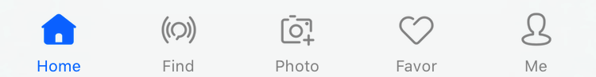
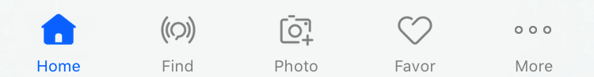
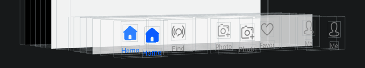
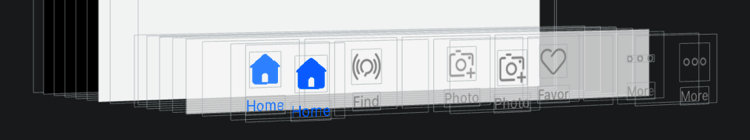
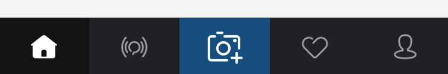
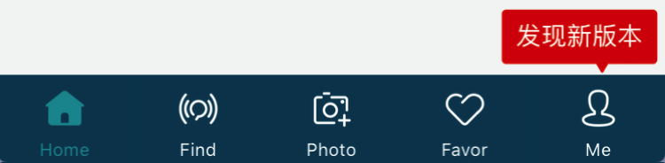
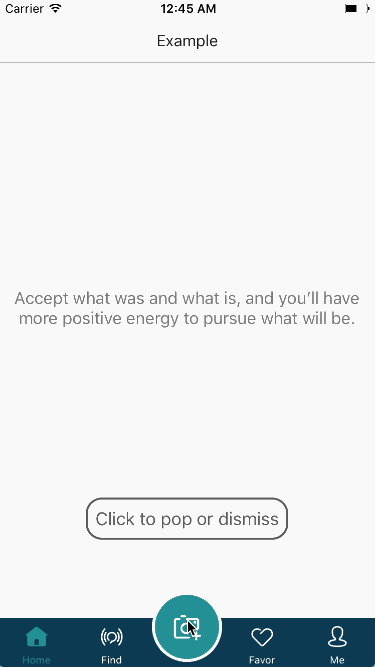
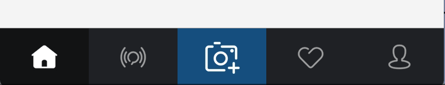
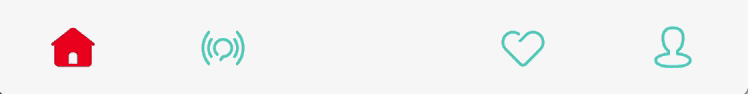

### [For English](README.md)

**MagiTabBarController**是一个高度自定义的TabBarController组件，继承自UITabBarController。

### 为什么要使用?

在开发工作中，我们可能会遇到需要自定义UITabBar的情况。例如：改变文字样式、添加一些动画效果、设置一个比默认更大的样式等等，以上需求如果只通过UITabBarItem往往很难实现。

**有了MagiTabBarController，你可以轻松地实现这些！**

-| 功能 |说明
-------------|-------------|-------------
1| 支持默认样式 | 如果直接使用MagiTabBarController进行初始化，你会得到与UITabBarController完全相同的仿系统样式 </p> UITabBarController样式: </p>  </p> MagiTabBarController仿系统样式: </p> 
2| 支持带有"More"的默认样式 | 使用MagiTabBarController进行初始化，若item大于最大显示数量则显示"More"，样式与UITabBarController一致 </p> 带有"More"的UITabBarController样式: </p>  </p> 带有"More"的MagiTabBarController样式: </p> 
3| 支持UITabBarItem和MagiTabBarItem混合 | 可以任意设置tabbar的items，支持即包含UITabBarItem，同时也包含MagiTabBarItem </p> MagiTabBar和UITabBar混合样式: </p>  </p> 带有'More'的MagiTabBar和UITabBar混合样式: </p> 
4| 支持UIKit属性 | 支持UITabBarController、UITabBar和UITabBarItem的大部分API属性，使原有代码无需任何修改即可无缝迁移到MagiTabBarController </p> 支持UITabBarController的`selectedIndex`属性的实现: </p> 
5| 支持与UINavigationController任意嵌套 | 通常在使用`UITabBarController`过程中，会存在两种比较常见的层级处理方式: </p> 第一种: </p> ├── UITabBarController </p> └──── UINavigationController </p> └────── UIViewController </p> └──────── SubviewControllers </p> 第二种: </p> ├── UINavigationController </p> └──── UITabBarController </p> └────── UIViewController </p> └──────── SubviewControllers </p> 第一种情况在push子视图的时候需要设置 `hidesBottomBarWhenPushed = true` , 第二种则不需要。 </p> 在MagiTabBarController中，通过添加Container视图到UITabBar的方式来兼容这两种层级处理方式。
6| 支持自定义 | 使用MagiTabBarController可以实现：</p> 1. 自定义选中颜色和样式 </p>  </p> 2. 添加选中时的动画效果 </p>  </p> 3. 自定义Item的背景颜色 </p>  </p> 4. 添加高亮时的动画效果 </p>  </p> 5. 添加一些动画暗示用户点击 </p>  </p> 6. 等等...... </p>
7| 支持自定义按钮大小 </p> 支持自定义点击事件 | MagiTabBarController支持自定义按钮的大小，你可以轻松定制不规则大小的tab按钮。</p> **当按钮frame大于TabBar时，通过HitTest方法使其超出TabBar区域点击仍然有效。** </p> 另外，MagiTabBarController能够自定义点击事件，并通过一个block回调给上层处理。 </p> 中间带有较大按钮样式: </p>  </p> 带有特殊提醒框样式: </p>  </p> 自定义按钮点击事件: </p> 
8| 支持默认通知样式 | 如果直接使用MagiTabBarController进行初始化，你会得到与UITabBarController完全相同的仿系统通知样式 </p> UITabBarController样式: </p>  </p> MagiTabBarController仿系统样式: </p> 
9| 支持自定义通知样式 | 使用ESTabBarController可以实现：</p> 1. 自定义提醒动画 </p>  </p>  </p> 2. 自定义提醒样式 </p>  </p> 3. 等等...... </p>
10| 支持Lottie | 通过自定义ContentView，能够添加Lottie的LAAnimationView到Item </p> 

## 支持环境

* Xcode 8 or later
* iOS 8.0 or later
* ARC
* Swift 3 or later

## Demo

下载后运行MagiTabBarControllerExample工程，你可以看到一些使用ESTabBarController实现的自定义TabBar的更多例子。

## 如何安装

### CocoaPods

``` ruby
pod "MagiTabBarController"
```

### 手动安装

``` ruby
git clone https://github.com/AnRanScheme/MagiTabBarController.git
open MagiTabBarController
```

## 未完成的事

1. Containers的布局方式目前是纯代码布局，使用Autolayout应该会更好。
2. 当存在"More"时，若进行Edit会出现问题。
3. UITabBarItem的部分属性还没有桥接到MagiTabBarItem。


## 感谢:

* [animated-tab-bar](https://github.com/Ramotion/animated-tab-bar) by <http://ramotion.com> 
* Example中部分图片资源来自 <http://www.iconfont.cn>


## License

The MIT License (MIT)

Copyright (c) 2013-2016 eggswift. All rights reserved.

Permission is hereby granted, free of charge, to any person obtaining a copy of this software and associated documentation files (the "Software"), to deal in the Software without restriction, including without limitation the rights to use, copy, modify, merge, publish, distribute, sublicense, and/or sell copies of the Software, and to permit persons to whom the Software is furnished to do so, subject to the following conditions:

The above copyright notice and this permission notice shall be included in all copies or substantial portions of the Software.

THE SOFTWARE IS PROVIDED "AS IS", WITHOUT WARRANTY OF ANY KIND, EXPRESS OR IMPLIED, INCLUDING BUT NOT LIMITED TO THE WARRANTIES OF MERCHANTABILITY, FITNESS FOR A PARTICULAR PURPOSE AND NONINFRINGEMENT. IN NO EVENT SHALL THE AUTHORS OR COPYRIGHT HOLDERS BE LIABLE FOR ANY CLAIM, DAMAGES OR OTHER LIABILITY, WHETHER IN AN ACTION OF CONTRACT, TORT OR OTHERWISE, ARISING FROM, OUT OF OR IN CONNECTION WITH THE SOFTWARE OR THE USE OR OTHER DEALINGS IN THE SOFTWARE.

